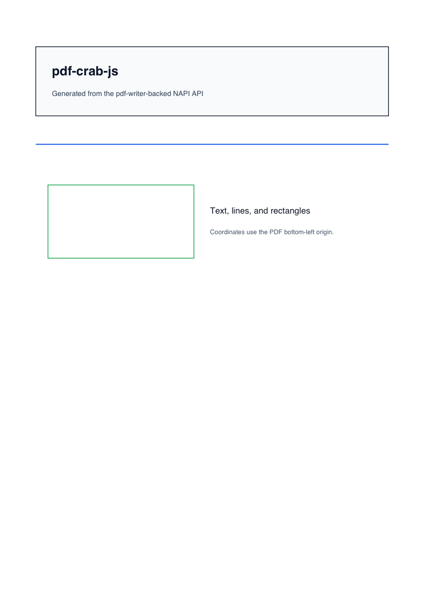
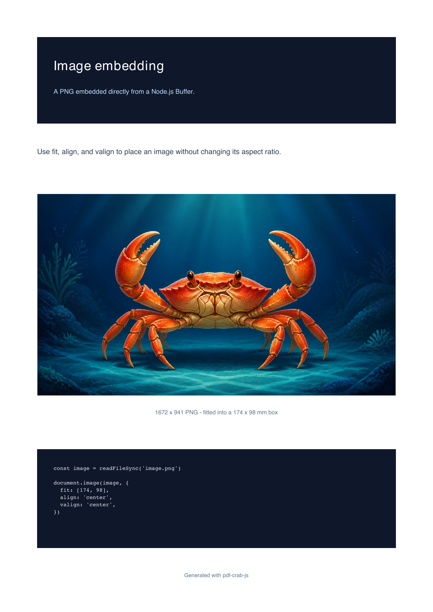

# pdf-crab-js Examples

Runnable examples for generating structured PDFs with `pdf-crab-js`.

## PDF Results

Declarative document from [`src/node/declarative.ts`](./src/node/declarative.ts):



Table document from [`src/node/table.ts`](./src/node/table.ts):


Image document from [`src/node/image.ts`](./src/node/image.ts):



## Run

Run the Node examples from the repository root:

```bash
pnpm --filter pdf-crab-js-examples example:declarative
pnpm --filter pdf-crab-js-examples example:image
pnpm --filter pdf-crab-js-examples example:stream
pnpm --filter pdf-crab-js-examples example:table
```

The generated PDFs are written to `examples/pdf-crab-js/output/`. The stream example writes both
`renderPdf(...).stream()` and `document.render().stream()` through a Node `Readable`/`pipeline`
adapter. See [`stream/README.md`](./stream/README.md) for the browser/WASM example as well.

All implementation sources live under `src/`: Node.js examples are in `src/node/`, and browser/WASM sources are in
`src/browser/`. The top-level `stream/` and `wasm/` directories contain only their HTML entry pages and supporting
documentation.

Run the browser WASM example:

```bash
pnpm --filter pdf-crab-js-examples browser
```

The browser command builds the local single-threaded `wasm32-wasip1` binding before starting Vite.
It does not set COOP/COEP and does not require `SharedArrayBuffer`. The optional
`pdf-crab-js/browser/threaded` entry remains available for isolated deployments.

Open `/wasm/` for the regular example or `/stream/` for the streaming example. The pages preview a
structured `PdfDocumentInput` object and render it into a PDF iframe. The browser examples import
`pdf-crab-js/browser.js` and consume the generated local WASI artifact directly. All example
coordinates use the 1.0 top-left origin.

## Screenshot Maintenance

Regenerate the PDFs, then refresh the screenshot thumbnails:

```bash
pnpm --filter pdf-crab-js-examples example:declarative
pnpm --filter pdf-crab-js-examples example:image
pnpm --filter pdf-crab-js-examples example:stream
pnpm --filter pdf-crab-js-examples example:table
qlmanage -t -s 1200 -o examples/pdf-crab-js/screenshots \
  examples/pdf-crab-js/output/pdf-crab-js-declarative-example.pdf
pdftoppm -f 1 -singlefile -png -r 144 examples/pdf-crab-js/output/pdf-crab-js-image-example.pdf \
  examples/pdf-crab-js/screenshots/pdf-crab-js-image-example.pdf
qlmanage -t -s 1200 -o examples/pdf-crab-js/screenshots examples/pdf-crab-js/output/pdf-crab-js-table-example.pdf
```
